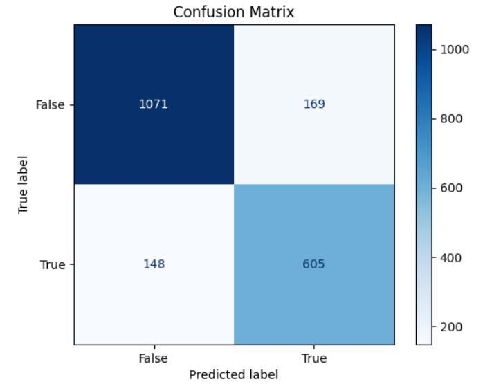
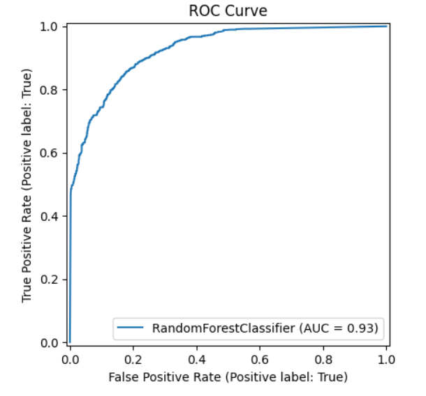
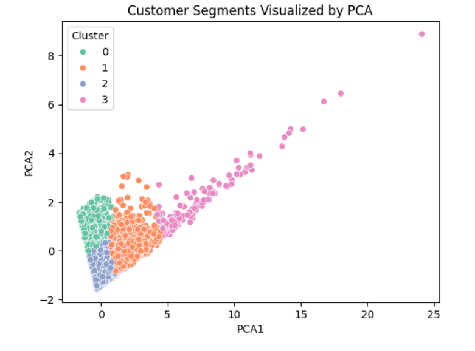

# AI-Driven Loyalty Program Optimization for Retail Supermarkets in Kenya

**Capstone Group 2:** Sylvia, Clive, Ezekiel, Brenda, Isaiah  
**Date:** June 2025

---

## Business Context & Problem

- Traditional loyalty programs are generic and poorly targeted.
- Result in low engagement, inefficient promotions, and declining retention.
- Goal: Use AI to personalize loyalty strategies for Kenyan supermarkets.

---

## Project Objectives

1. Segment customers using behavioral data.
2. Predict customer churn.
3. Identify high-value customers.

---

## Data Overview

- `customer_info.csv`: Demographics and customer metadata.
- `POS_Transactions.csv`: Transaction details including basket size and spend.
- Combined and engineered into RFM features and churn labels.

---

## Methodology

- Data cleaning and preprocessing.
- RFM analysis (Recency, Frequency, Monetary).
- Churn prediction with classification models.
- Customer segmentation with KMeans clustering.

---

## Churn Prediction Results

### Confusion Matrix

> Interpretation: High true positives and negatives indicate strong model performance.

### ROC Curve

> ROC-AUC score of 0.92 shows excellent discriminatory ability.

---

## Customer Segmentation

### Cluster Visualization

> KMeans clustering identified 4 distinct groups, enabling targeted strategies.

---

## Business Insights

- Identify and prioritize high-value segments for tailored offers.
- Intervene early with customers predicted to churn.
- Allocate marketing budget efficiently using customer tiers.

---

## Recommendations

- Deploy churn model for regular customer monitoring.
- Personalize rewards based on customer segments.
- Conduct A/B testing on targeted promotions.

---

## Next Steps & Limitations

- Implement model feedback loop.
- Monitor and retrain on new data regularly.
- Consider additional features like in-store activity.
- Address potential model bias and data privacy concerns.

---

## More Information
Find the full analysis in the [Capstone Jupyter Notebook](./Group_2_Phase_5_Project_Capstone.ipynb) or this [presentation](./presentation.pdf).

For additional info, contact Capstone Group 2 Team
